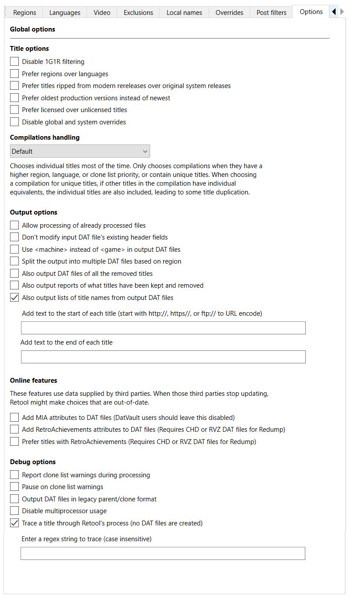

---
hide:
  - footer
---

# Options

Options change Retool's behavior either at the title level, or the broader DAT level.

To set options, in the **Global settings** or **System settings** tab, click the
**Options** tab.

## Title options

These options change how Retool handles certain titles.

* **Disable 1G1R filtering**
   Ignore clone lists, and treat each title as unique. Useful if you want to keep
  everything from a specific set of regions and/or languages. You can use this in
  combination with **Split the output into multiple DAT files based on region** to treat
  Retool as a region splitter and nothing more.
   
   If this option is disabled, it's because you've enabled
  **Output DAT in legacy parent/clone format**, which isn't compatible with this feature.

* **Prefer regions over languages**
   By default, if a title from a higher priority region doesn't support your preferred
  languages but a lower priority region does, Retool selects the latter. This option
  disables this behavior, forcing strict adherence to region priority regardless of
  language support
   
   This option also overrides similar behavior in superset selection, which means you
  might get a title that was released in your preferred region that has less content,
  instead of one that was released in another region that contains more content and
  supports your preferred languages.

* **Include titles without hashes or sizes specified in the input DAT file**
   Some DAT files don't list any hashes or sizes for some files, and Retool filters these
  out by default. This option makes sure those files are kept.

* **Prefer titles ripped from modern rereleases over original system releases**
   For the sake of emulator compatibility, Retool prefers versions of games released
  on the original system instead of those ripped from rereleases on platforms like
  Virtual Console and Steam. This option reverses that behavior.

* **Prefer licensed versions over unlicensed, aftermarket, or homebrew titles**
   Sometimes games are rereleased long after the lifespan of a console, in regions they
  weren't originally available in. By default Retool selects these titles if they match
  your preferred region/language priorities.
   
   Enable this option to choose a production version of a title over the
  unlicensed/aftermarket/homebrew title if possible. This might select titles from a lower
  priority region, or with lower priority languages, or with less features.

* **Disable global and system overrides**
   Ignore both global and system overrides.

## Output options

These options change the files that Retool outputs as part of its process.

* **Use the original input DAT header**
   Retool generates its own header so its DATs are identified as different from the
  original input DATs. Selecting this option uses the original input DAT header instead.
  This is useful if you already have original Redump and No-Intro DATs in CLRMAMEPro, and
  want to treat the Retool DAT as an update.

* **Split the output into multiple DAT files based on region**
   Instead of one output DAT containing all the filtered results, split the output into
  multiple DAT files based on the regions you've selected. If this is disabled, it's
  because you've enabled **Output DAT in legacy parent/clone format**, which isn't
  compatible with this option.

* **Also output a DAT file of all the removed titles**
   In addition to the output DAT file, create another DAT file containing the titles
  Retool removed.

* **Also output lists of what titles have been kept and removed**
   In addition to the output DAT file, produce a TXT file that lists what titles have
  been kept, and what titles have been removed.

* **Also output a list of just the title names from the output DAT file**
   In addition to the output DAT file, produce a TXT file that lists only the name of
  each title in the output DAT file, and optionally add a prefix and suffix to each name.
  If you add a prefix that starts with `http://`, `https://` or `ftp://`, each line in the
  file is URL encoded.

## Debug options

These options are useful for developing and testing Retool.

* **Report clone list warnings during processing**
   Turn on warnings when there are mismatches between the clone list and the DAT file.

* **Pause on clone list warnings**
   Pause Retool each time a clone list warning is issued.

* **Output DAT in legacy parent/clone format**
   Not recommended unless you're debugging or comparing outputs between DAT versions.
  If this is disabled, it's because you've disabled 1G1R filtering or chosen to split by
  region, which isn't compatible with this option.

* **Bypass DTD validation**
   Skips DTD validation of DAT files, useful if validation is causing issues.

* **Disable multiprocessor usage**
   Forces Retool to use only a single CPU core, at the cost of performance. This can
  be useful when debugging Retool, as multiprocessor doesn't cope well with `input`
  statements.

* **Trace a title through Retool's process**
   Follows a title through Retool's selection process for debugging. Accepts a regular
  expression. To function properly, this disables using multiple processors during parent
  selection.

!!! tip
    If you don't know regular expressions, also known as "regexes", you can
    [learn the basics at regexlearn.com](https://regexlearn.com/learn/regex101). You want
    to be well practiced before using them, as without proper care they can lead to
    unintended consequences.
