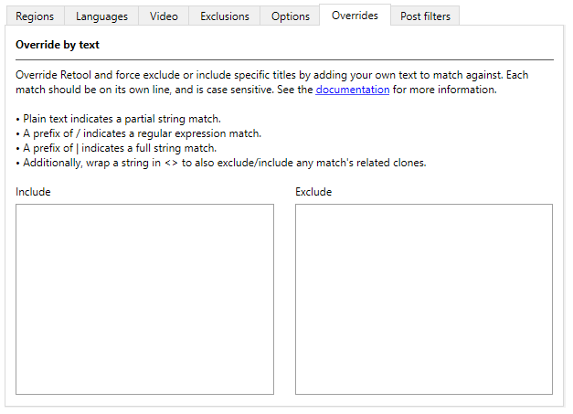
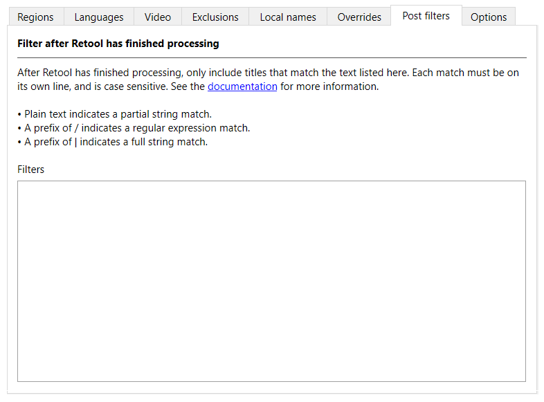

---
hide:
  - footer
---

# Overrides and post filters

There are two ways you can remove or include specific titles in Retool: overrides and
post filters.

!!! note
    If Retool has genuinely missed a relationship between titles, don't just create an
    override or post filter &mdash; [create an issue](https://github.com/unexpectedpanda/retool/issues)
    too so the clone lists or Retool can be updated.

## Overrides

You can override the default choices Retool makes by force including or excluding
titles whose names match against text you provide. Each match must be on its own line.

To set overrides, in the **Global settings** or **System settings** tab, click the
**Overrides** tab.



An excluded title forces Retool to act as if the title was never in the input DAT file in
the first place. This means that an exclude can force Retool to select a different title
when choosing 1G1R titles.

An included title makes it into the output DAT file regardless of Retool's choices. Even
if Retool has removed a title as part of the filtering process, a matching include brings
it back. Only a post filter can remove an included title.

There are rules when it comes to overrides, and how they interact at the global settings
and system settings level:

* System includes override all excludes.
* System excludes override global includes.
* Global includes override global excludes.

To read about the different ways you can match titles, see [Match types](#match-types).

## Post filters

After Retool has finished processing, you can filter the results to only include titles
that match the text you provide. Each match must be on its own line.

To set post filters, in the **Global settings** or **System settings** tab, click the
**Post filters** tab.



To read about the different ways you can match titles, see [Match types](#match-types).

## Match types

There are three different match types for overrides and post filters:

* Plain text indicates a partial string match.
* A prefix of `/` indicates a regular expression match.
* A prefix of `|` indicates a full string match.

Additionally, you can wrap any of these strings in `<>` when using overrides to also
include or exclude any match's related clones. Wrapping strings in `<>` is not supported
for post filters.

Regardless of whether you use an override or a post filter, matches are case insensitive.

### Partial matches

If a line isn't prefixed with `|` (full match) or `/` (regular expression) in an
**Exclude** or **Include** box, then it's interpreted as a partial match. A partial
match looks for the specified text inside all title names.

For example, if an input DAT file contains the following title names:

```
Do You Think it's Hot (USA)
Do You Think it's Hot (USA) (Alt)
It's Pretty Cold (Japan)
I Can't Find My Hotel (Europe)
```

And you put the following text in the **Exclude** box:

```
Hot
Cold
```

Every title in the example list is excluded from the output DAT file. This is because
`Cold` matches `It's Pretty Cold (Japan)`, and `Hot` matches every other title, as it's
found in both the word `Hot` and `Hotel`.

If we also add the following text to the **Include** box:

```
Ho
```

The behavior changes again:

* The include for `Ho` overrides the exclude for `Hot`.
* The include for `Ho` prevents Retool from assigning
  `Do You Think it's Hot (USA) (Alt)` to `Do You Think it's Hot (USA)` as a clone,
  meaning _both_ titles end up in the output DAT file.

As you can see, you need to be careful when using partial matches.

### Regular expressions

If you're familiar with regular expressions, also known as "regexes", you know the power
(and pain) that they can bring. To define an include or exclude as a regex, prefix it
with a forward slash (`/`).

!!! tip
    If you don't know regex, you can [learn the basics at regexlearn.com](https://regexlearn.com/learn/regex101).
    You want to be well practiced before using them, as without proper care they can lead
    to unintended consequences.

For example, if an input DAT file contains the following title names:

```
Do You Think it's Hot (USA)
Do You Think it's Hot (USA) (Alt)
It's Pretty Cold (Japan)
I Can't Find My Hotel (Europe)
```

And you put the following text in an **Exclude** box:

```
/^I
```

All titles beginning with `I` are excluded from the output DAT file.

If you also put the following text in an **Include** box:

```
/\(USA\)
```

All USA titles are kept, even if they start with `I`. In the example list the `(Alt)`
title is usually removed by Retool as a clone of the original, but the include filter
makes sure it's kept.

### Full matches

Full matches only apply to titles with the exact same name. To define an include or
exclude as a full match, prefix it with a pipe (`|`).

For example, if an input DAT file contains the following titles:

```
Do You Think it's Hot (USA)
Do You Think it's Hot (USA) (Alt)
It's Pretty Cold (Japan)
I Can't Find My Hotel (Europe)
```

And you put the following text in an **Exclude** box:

```
|Do You Think it's Hot (USA)
```

Then that title is excluded from the output DAT file.

If you remove the exclude, and then put the following text in an **Include** box:

```
|Do You Think it's Hot (USA) (Alt)
```

Then that title is kept in the output DAT file, and the final titles chosen are:

```
Do You Think it's Hot (USA)
Do You Think it's Hot (USA) (Alt)
It's Pretty Cold (Japan)
I Can't Find My Hotel (Europe)
```

In the example list the `(Alt)` title is usually removed by Retool as a clone of the
original, but the include filter makes sure it's kept.
