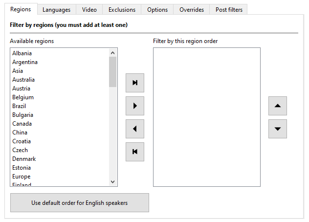
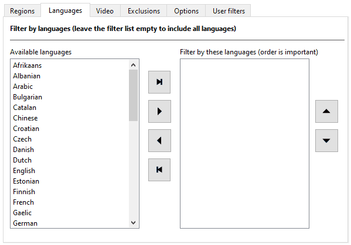
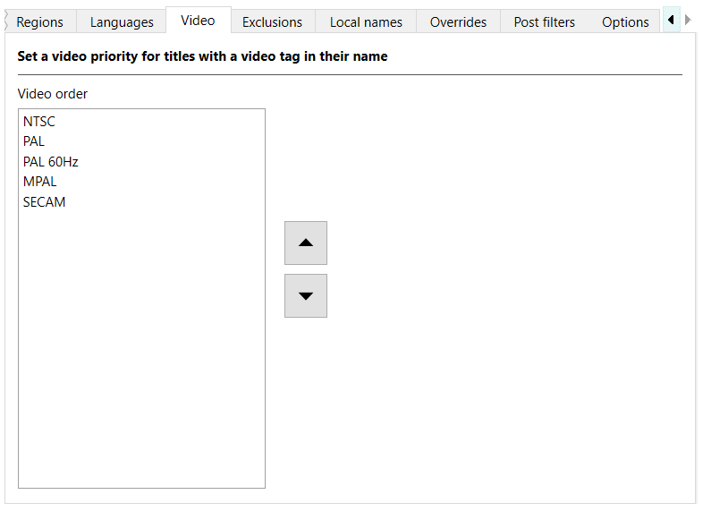

---
hide:
  - footer
---

# Region, language, and video priorities

Retool supports three different types of priorities: regions, languages, and video.

## Regions

You must have at least one region in the **Filter by these regions** box for the
**Process DAT files** button to be enabled. Only regions in **Filter by these regions**
box are considered when Retool is processing a DAT file. If a title is from another
region, it's removed from the output DAT file.

Order in the **Filter by these regions** box is important. For example, if you place USA
above Europe, and the title exists in both regions, during processing Retool chooses the
USA title.

### Change the region order

To view the regions, in the **Global settings** or **System settings** tab, click the
**Regions** tab.



You can move regions from the **Available regions** box to the **Filter by these regions**
box in the following ways:

* Drag and drop with the mouse.

* Select one or more regions in the **Available regions** box, and then click
  {:.inline-icon .move-button}
  **Add regions**.

* Click
  {:.inline-icon .move-button}
  **Add remaining regions**, which adds the regions in the **Available regions** box to
  the end of the list in the **Filter by these regions** box.

* Click **Use default order for English speakers** to add the recommended region order
  if English is your first language. This also attempts to prioritize NTSC regions over
  PAL regions.

You can move regions from the **Filter by these regions** box to the **Available regions**
box in the following ways:

* Drag and drop with the mouse.
* Select one or more regions in the **Filter by these regions** box, and then click
  {:.inline-icon .move-button}
  **Remove regions**.
* Click
  {:.inline-icon .move-button}
  **Remove all regions**, which returns all regions to the **Available regions** box.

You can change the order of the regions in the **Filter by these regions** box in the
following ways:

* Drag and drop with the mouse.

* Select one or more regions in the **Filter by these regions** box, and then click
  {:.inline-icon .move-button}
  **Up** or {:.inline-icon .move-button}
  **Down**.

!!! tip
    A combination of ++ctrl++ (++cmd++ on macOS), ++shift++, and clicking allows for
    multiple region selections.

## Languages

If no languages are in the **Filter by these languages** box, then Retool considers all
languages during processing, and [infers a language order](../terminology/#implied-languages)
from your region order.

If you add languages to the **Filter by these languages** box, then only those languages
are considered when Retool is processing a DAT file. If a title doesn't support a language
in that list, it's removed from the output DAT file unless the language is unknown.

Order in the **Filter by these languages** box is important. For example, if you have the
following title names in an input DAT file:

```
This is a title (Europe) (En,Fr,De)
This is a title (Europe) (En,Fr,De,Es,It)
This is a title (Europe) (Es)
This is a title (Europe) (Fr,De,Es,It)
```

And the following language order:

1.  English

1.  Spanish

1.  Italian

Then the following title is selected as the 1G1R title:

```
This is a title (Europe) (En,Fr,De,Es,It)
```

And these titles are removed from consideration:

```
This is a title (Europe) (Es)
This is a title (Europe) (Fr,De,Es,It)
This is a title (Europe) (En,Fr,De)
```

This is because `This is a title (Europe) (En,Fr,De,Es,It)` supports all three languages.

### Change the language order

To view the languages, in the **Global settings** or **Sytem settings** tab, click the
**Languages** tab.



You can move languages from the **Available languages** box to the
**Filter by these languages** box in the following ways:

* Drag and drop with the mouse.

* Select one or more languages in the **Available languages** box, and then click
  {:.inline-icon .move-button}
  **Add languages**.

* Click
  {:.inline-icon .move-button}
  **Add remaining languages**, which adds the languages in the **Available languages** box to
  the end of the list in the **Filter by these languages** box.

You can move languages from the **Filter by these languages** box to the
**Available languages** box in the following ways:

* Drag and drop with the mouse.
* Select one or more languages in the **Filter by these languages** box, and then click
  {:.inline-icon .move-button}
  **Remove languages**.
* Click
  {:.inline-icon .move-button}
  **Remove all languages**, which returns all languages to the **Available languages** box.

You can change the order of the languages in the **Filter by these languages** box in the
following ways:

* Drag and drop with the mouse.

* Select one or more languages in the **Filter by these languages** box, and then click
  {:.inline-icon .move-button}
  **Up** or {:.inline-icon .move-button}
  **Down**.

!!! tip
    A combination of ++ctrl++ (++cmd++ on macOS), ++shift++, and clicking allows for
    multiple language selections.

## Video

Video standards are processed after regions, languages, and many other criteria like
versions and supersets. Additionally, a video standard is only determined by an explicit
tag in a title's name, for example `This is a title (World) (NTSC)`. As such, the video
order is effectively only used as a tie-breaker when choosing between two titles that both
specify a video standard in their names. Don't expect to get NTSC titles if you prioritize
NTSC as a video standard, but put Europe first in your region order.

### Change the video order

To view the video order, in the **Global settings** or **Sytem settings** tab, click the
**Video** tab.

You can change the order of the video standards in the **Video order** box in the
following ways:

* Drag and drop with the mouse.

* Select one or more video standards in the **Video order** box, and then click
  {:.inline-icon .move-button}
  **Up** or {:.inline-icon .move-button}
  **Down**.



!!! tip
    A combination of ++ctrl++ (++cmd++ on macOS), ++shift++, and clicking allows for
    multiple language selections.
