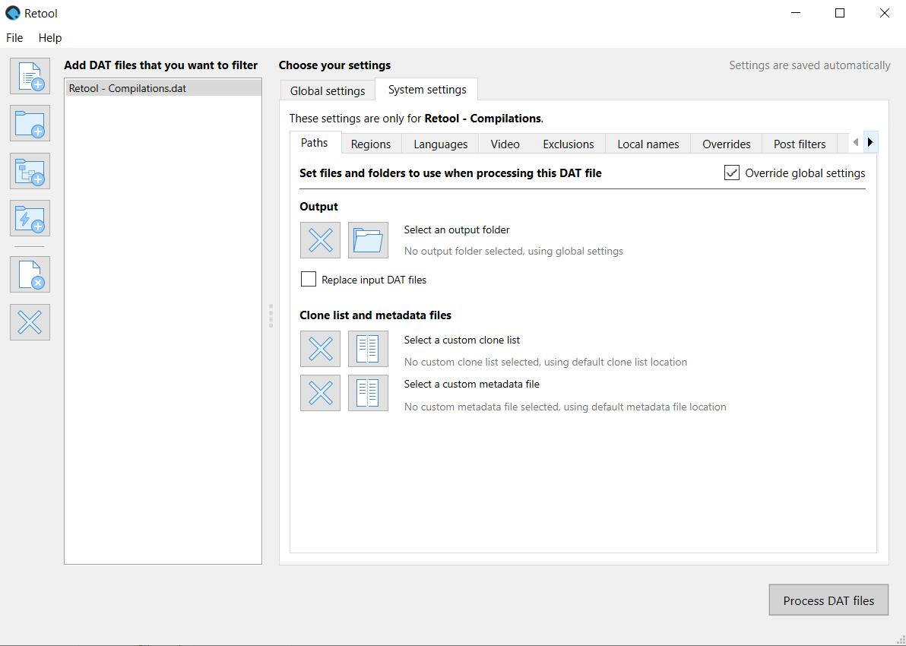

---
hide:
  - footer
---

# System settings

To view a DAT file's system settings, click the **System settings** tab, and then click a
DAT file that you've added to your list.

System settings are applied to a specific system named in a DAT file. For example, you can
have settings for just the _Sony - PlayStation_ DAT file from Redump. When you load a
different version of that DAT file in Retool, so long as the system name and release group
haven't changed, the system settings still apply.

On most system settings tabs there is an **Override global settings** checkbox. When
selected, this means that the system settings are used for those settings instead of the
global ones whenever that DAT file is processed.

System settings mostly mirror what's available in the global settings, although there are
some unique features.

### Paths

The **Paths** tab is unique to system settings, and lets you select a custom output
folder, clone list, and metadata file for the selected system. If the override checkbox is
selected and a path hasn't been chosen for one of these options, then that option uses the
default or global setting instead.

### System overrides
The **Overrides** tab in the system settings has no override checkbox. Instead, it
interacts with the global settings overrides. See [Overrides](../how-to-use-retool-gui-overrides-post-filters#overrides)
for how the global and system overrides interact, and the rules for creating the
overrides.
