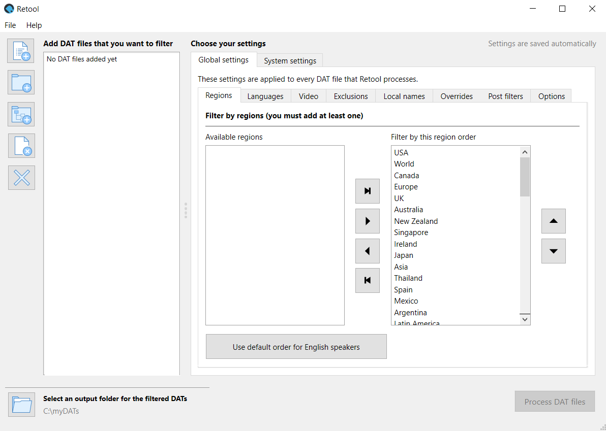

---
hide:
  - footer
---

# How to use Retool GUI

What follows is a step-by-step walkthrough of using Retool GUI and all of its features. If
you're new to DAT file management, it might be beneficial to spend some time reading about
[terminology](terminology.md), and after you've filtered a DAT file with Retool, check
out the help documentation for your favorite ROM manager to learn how to use it.

!!! Info
    Depending on your operating system, all Python commands in this guide might need to be
    prefixed with `python` or `python3` to work.

## Get started

The following sections cover the initial setup for Retool.

### Download DAT files and Retool

Before you can filter DAT files, they need to be on your hard drive.

1.  Download the DAT files for the system you want to verify. Retool supports DAT files
    from the following groups:

    * [No-Intro](https://datomatic.no-intro.org/index.php?page=download)

    * [Redump](http://redump.org/downloads/)

    You might need to extract a ZIP file containing the DAT files to access them.

1.  [Download Retool](download.md), and follow the installation and update instructions for
    your platform.

### Open Retool

=== ":simple-windows: Windows binary"
    Navigate to the folder you extracted Retool to, and double click `retoolgui.exe`. A
    terminal window shows, which in turn loads the GUI. Don't close the terminal window,
    as it's used for output.

=== ":simple-python: Python GUI"
    In your terminal/Command Prompt, change the folder to where Retool is installed, and
    then run the following command:

    ```
    retoolgui.py
    ```



### Add or remove DAT files

To process DAT files, you first need to add them to your list:

* Click {:.inline-icon}
  **Add DAT files to the list** to add individual files to the list.
* Click {:.inline-icon}
  **Add a folder of DAT files to the list** to add all the DAT files in a single folder to the
  list.
* Click {:.inline-icon}
  **Add a folder of DAT files recursively to the list** to add all the DAT files in a folder
  and its subfolders to the list.

You can also remove DAT files from your list:

* Select one or more DAT files in the list, and then click
  {:.inline-icon}
  **Remove selected DAT files from the list** to remove the DAT files from the list.
* Click {:.inline-icon}
  **Remove all DAT files from the list** to clear the list.

You must have at least one DAT file in the list for the **Process DAT files** button to
be enabled.

### Set an output folder

Click {:.inline-icon}
**Choose an output folder** to set where you want Retool to output processed DAT files.
Retool doesn't modify any of the DAT files added to the list; instead, it creates new
versions of them in the specified folder.

## Global and system settings

Settings are available at two levels in Retool: global and system.

* **Global settings** are applied to every DAT file Retool processes, so long as system
  settings don't override them.

* **System settings** are applied to a specific system named in a DAT file. For example,
  you can have settings for just the _Sony - PlayStation_ DAT file from Redump.
  [System settings](how-to-use-retool-gui-system-settings.md) mostly mirror what's
  available in the global settings, although there are some unique features.
