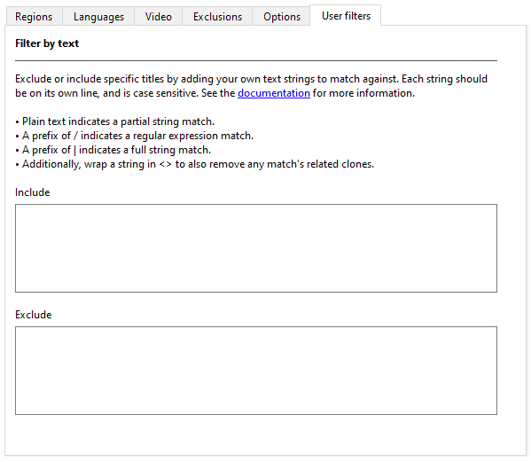

---
hide:
  - footer
---

# How to use Retool GUI

What follows is a step-by-step walkthrough of using Retool GUI and all of its features. If
you're new to DAT management, it might be beneficial to spend some time reading about
[terminology](../terminology), and after you've filtered a DAT file with Retool, check
out the help documentation for your favorite ROM manager to learn how to use it.

!!! Info
    Depending on your operating system, all Python commands in this guide might need to be
    prefixed with `python` or `python3` to work.

## Get started

The following sections cover the initial setup for Retool.

### Download DAT files and Retool

Before you can filter DAT files, they need to be on your hard drive.

1.  Download the DAT files for the system you want to verify. Retool supports DAT files
    from the following groups:

    * [No-Intro](https://datomatic.no-intro.org/index.php?page=download)

    * [Redump](http://redump.org/downloads/)

    You might need to extract a ZIP file containing the DAT files to access them.

1.  [Download Retool](../download), and follow the installation and update instructions for
    your platform.

### Open Retool

=== ":simple-windows: Windows binary"
    Navigate to the folder you extracted Retool to, and double click `retoolgui.exe`. A
    terminal window shows, which in turn loads the GUI. Don't close the terminal window,
    as it's used for output.

=== ":simple-python: Python GUI"
    In your terminal/Command Prompt, change the folder to where Retool is installed, and
    then run the following command:

    ```
    retoolgui.py
    ```


### Add or remove DAT files

To process DAT files, you first need to add them to your list:

* Click {:.inline-icon}
  **Add DAT files to the list** to add individual files to the list.
* Click {:.inline-icon}
  **Add a folder of DAT files to the list** to add all the DAT files in a single folder to the
  list.
* Click {:.inline-icon}
  **Add a folder of DAT files recursively to the list** to add all the DAT files in a folder
  and its subfolders to the list.

You can also remove DAT files from your list:

* Select one or more DAT files in the list, and then click
  {:.inline-icon}
  **Remove selected DAT files from the list** to remove the DAT files from the list.
* Click {:.inline-icon}
  **Remove all DAT files from the list** to clear the list.

You must have at least one DAT file in the list for the **Process DAT files** button to
be enabled.

### Set an output folder

Click {:.inline-icon}
**Choose an output folder** to set where you want Retool to output processed DAT files.
Retool doesn't modify any of the DAT files added to the list; instead, it creates new
versions of them in the specified folder.

## Global and system settings

Settings are available at two levels in Retool: global and system.

* **Global settings** are applied to every DAT Retool processes, so long as system
  settings don't override them.

* **System settings** are applied to a specific system named in a DAT file. For example,
  you can have settings for just the _Sony - PlayStation_ DAT file from Redump.
  [System settings](#system-settings) mostly mirror what's available in the global
  settings, although there are some unique features.

## Priorities

Retool supports three different types of priorities: regions, languages, and video.

### Regions

You must have at least one region in the **Filter by these regions** box for the
**Process DAT files** button to be enabled. Only regions in **Filter by these regions**
box are considered when Retool is processing a DAT file. If a title is from another
region, it's removed from the output DAT file.

Order in the **Filter by these regions** box is important. For example, if you place USA
above Europe, and the title exists in both regions, during processing Retool chooses the
USA title.

#### Change the region order

To view the regions, in the **Global settings** or **System settings** tab, click the
**Regions** tab.


You can move regions from the **Available regions** box to the **Filter by these regions**
box in the following ways:

* Drag and drop with the mouse.

* Select one or more regions in the **Available regions** box, and then click
  {:.inline-icon .move-button}
  **Add regions**.

* Click
  {:.inline-icon .move-button}
  **Add remaining regions**, which adds the regions in the **Available regions** box to
  the end of the list in the **Filter by these regions** box.

* Click **Use default order for English speakers** to add the recommended region order
  if English is your first language. This also attempts to prioritize NTSC regions over
  PAL regions.

You can move regions from the **Filter by these regions** box to the **Available regions**
box in the following ways:

* Drag and drop with the mouse.
* Select one or more regions in the **Filter by these regions** box, and then click
  {:.inline-icon .move-button}
  **Remove regions**.
* Click
  {:.inline-icon .move-button}
  **Remove all regions**, which returns all regions to the **Available regions** box.

You can change the order of the regions in the **Filter by these regions** box in the
following ways:

* Drag and drop with the mouse.

* Select one or more regions in the **Filter by these regions** box, and then click
  {:.inline-icon .move-button}
  **Up** or {:.inline-icon .move-button}
  **Down**.

!!! tip
    A combination of ++ctrl++ (++cmd++ on macOS), ++shift++, and clicking allows for
    multiple region selections.

### Languages

If no languages are in the **Filter by these languages** box, then Retool considers all
languages during processing, and [infers a language order](../terminology/#implied-languages)
from your region order.

If you add languages to the **Filter by these languages** box, then only those languages
are considered when Retool is processing a DAT file. If a title doesn't support a language
in that list, it's removed from the output DAT file unless the language is unknown.

Order in the **Filter by these languages** box is important. For example, if you have the
following title names in an input DAT file:

```
This is a title (Europe) (En,Fr,De)
This is a title (Europe) (En,Fr,De,Es,It)
This is a title (Europe) (Es)
This is a title (Europe) (Fr,De,Es,It)
```

And the following language order:

1.  English

1.  Spanish

1.  Italian

Then the following title is selected as the 1G1R title:

```
This is a title (Europe) (En,Fr,De,Es,It)
```

And these titles are removed from consideration:

```
This is a title (Europe) (Es)
This is a title (Europe) (Fr,De,Es,It)
This is a title (Europe) (En,Fr,De)
```

This is because `This is a title (Europe) (En,Fr,De,Es,It)` supports all three languages.

#### Change the language order

To view the languages, in the **Global settings** or **Sytem settings** tab, click the
**Languages** tab.


You can move languages from the **Available languages** box to the
**Filter by these languages** box in the following ways:

* Drag and drop with the mouse.

* Select one or more languages in the **Available languages** box, and then click
  {:.inline-icon .move-button}
  **Add languages**.

* Click
  {:.inline-icon .move-button}
  **Add remaining languages**, which adds the languages in the **Available languages** box to
  the end of the list in the **Filter by these languages** box.

You can move languages from the **Filter by these languages** box to the
**Available languages** box in the following ways:

* Drag and drop with the mouse.
* Select one or more languages in the **Filter by these languages** box, and then click
  {:.inline-icon .move-button}
  **Remove languages**.
* Click
  {:.inline-icon .move-button}
  **Remove all languages**, which returns all languages to the **Available languages** box.

You can change the order of the languages in the **Filter by these languages** box in the
following ways:

* Drag and drop with the mouse.

* Select one or more languages in the **Filter by these languages** box, and then click
  {:.inline-icon .move-button}
  **Up** or {:.inline-icon .move-button}
  **Down**.

!!! tip
    A combination of ++ctrl++ (++cmd++ on macOS), ++shift++, and clicking allows for
    multiple language selections.

### Video

Video standards are processed after regions, languages, and many other criteria like
versions and supersets. Additionally, a video standard is only determined by an explicit
tag in a title's name, for example `This is a title (World) (NTSC)`. As such, the video
order is effectively only used as a tie-breaker when choosing between two titles that both
specify a video standard in their names. Don't expect to get NTSC titles if you prioritize
NTSC as a video standard, but put Europe first in your region order.

#### Change the video order

To view the video order, in the **Global settings** or **Sytem settings** tab, click the
**Video** tab.

You can change the order of the video standards in the **Video order** box in the
following ways:

* Drag and drop with the mouse.

* Select one or more video standards in the **Video order** box, and then click
  {:.inline-icon .move-button}
  **Up** or {:.inline-icon .move-button}
  **Down**.


!!! tip
    A combination of ++ctrl++ (++cmd++ on macOS), ++shift++, and clicking allows for
    multiple language selections.

## Exclusions

Retool can exclude specific types of titles from the output DAT file. These exclusions are
either based on the `<category>` tag found in DAT files, or on a string in the title's
name.

To add exclusions, in the **Global settings** or **System settings** tab, click the
**Exclusions** tab.


The available exclusions are as follows:

* **Add-ons**
  <br>Titles with the DAT category `Add-Ons`. This includes expansion packs and additional
  materials for titles.

* **Applications**
  <br>Titles with the DAT category `Applications`, or with the following text in the name:
    * `(Program)`
    * `(Test Program)`
    * `Check Program`
    * `Sample Program`

* **Audio**
  <br>Titles with the DAT category `Audio`. These might be used as soundtracks by games.

* **Bad dumps**
  <br>Titles marked as bad dumps with a `[b]` in the name.

* **BIOS and other chips**
  <br>Titles with the DAT category `Console`, or with the following text in the name:
    * `[BIOS]`
    * `(Enhancement Chip)`

* **Bonus discs**
  <br>Titles with the DAT category `Bonus Discs`. These could be anything other than the
  main title content, like patches, manuals, collector discs, or otherwise.

* **Coverdiscs**
  <br>Titles with the DAT category `Coverdiscs`. These were discs that were attached to
  the front of magazines, and could contain demos, or rarely, full games.

* **Demos, kiosks, and samples**
  <br>Titles with the DAT category `Demos`, or with the following text in the name:
    * `@barai`
    * `(Demo [1-9])`
    * `(Demo-CD)`
    * `(GameCube Preview)`
    * `(Kiosk *|* Kiosk)`
    * `(Preview)`
    * `Kiosk Demo Disc`
    * `PS2 Kiosk`
    * `PSP System Kiosk`
    * `Sample`
    * `Taikenban`
    * `Trial Edition`

* **Educational**
  <br>Titles with the DAT category `Educational`.

* **Manuals**
  <br>Titles with `(Manual)` in the name.

* **MIA**
  <br>Titles or ROMs declared as missing in action in the clone lists or DAT files.

* **Multimedia**
  <br>Titles with the DAT category `Multimedia`. These might include games.

* **Pirate**
  <br>Titles with `(Pirate)` in the name.

* **Preproduction**
  <br>Titles with the DAT category `Preproduction`, or with the following text in the
  name:
    * `(Alpha [0-99])`
    * `(Beta [0-99])`
    * `(Pre-Production)`
    * `(Possible Proto)`
    * `(Proto [0-99])`
    * `(Review Code)`

* **Promotional**
  <br>Titles with the DAT category `Promotional`, or with the following text in the name:
    * `(Promo)`
    * `EPK`
    * `Press Kit`

* **Unlicensed**
  <br>Titles unauthorized by console manufacturers, marked by the following text in the
  name:
    * `(Unl)`
    * `(Aftermarket)`
    * `(Homebrew)`

* **Video**
  <br>Titles with the DAT category `Video`.

## Options

Options change Retool's behavior either at the title level, or the broader DAT level.

To set options, in the **Global settings** or **System settings** tab, click the
**Options** tab.


### Title options

These options change how Retool handles certain titles.

* **Disable 1G1R filtering**
  <br>Ignore clone lists, and treat each title as unique. Useful if you want to keep
  everything from a specific set of regions and/or languages. You can use this in
  combination with **Split the output into multiple DAT files based on region** to treat
  Retool as a region splitter and nothing more.
  <br>
  <br>If this option is disabled, it's because you've enabled
  **Output DAT in legacy parent/clone format**, which isn't compatible with this feature.

* **Prefer regions over languages**
  <br>By default, if a title from a higher priority region doesn't support your preferred
  languages but a lower priority region does, Retool selects the latter. This option
  disables this behavior, forcing strict adherence to region priority regardless of
  language support
  <br>
  <br>This option also overrides similar behavior in superset selection, which means you
  might get a title that was released in your preferred region that has less content,
  instead of one that was released in another region that contains more content and
  supports your preferred languages.

* **Include titles without hashes or sizes specified in the input DAT file**
  <br>Some DAT files don't list any hashes or sizes for some files, and Retool filters these
  out by default. This option makes sure those files are kept.

* **Prefer titles ripped from modern rereleases over original system releases**
  <br>For the sake of emulator compatibility, Retool prefers versions of games released
  on the original system instead of those ripped from rereleases on platforms like
  Virtual Console and Steam. This option reverses that behavior.

* **Prefer licensed versions over unlicensed, aftermarket, or homebrew titles**
  <br>Sometimes games are rereleased long after the lifespan of a console, in regions they
  weren't originally available in. By default Retool selects these titles if they match
  your preferred region/language priorities.
  <br>
  <br>Enable this option to choose a production version of a title over the
  unlicensed/aftermarket/homebrew title if possible. This might select titles from a lower
  priority region, or with lower priority languages, or with less features.

* **Disable global and system user filters**
  <br>Ignore both global and system user filters.

### Output options

These options change the files that Retool outputs as part of its process.

* **Split the output into multiple DAT files based on region**
  <br>Instead of one output DAT containing all the filtered results, split the output into
  multiple DAT files based on the regions you've selected. If this is disabled, it's
  because you've enabled **Output DAT in legacy parent/clone format**, which isn't
  compatible with this option.

* **Also output a DAT file of all the removed titles**
  <br>In addition to the output DAT file, create another DAT file containing the titles
  Retool removed.

* **Also output lists of what titles have been kept and removed**
  <br>In addition to the output DAT file, produce a TXT file that lists what titles have
  been kept, and what titles have been removed.

* **Also output a list of just the title names from the output DAT file**
  <br>In addition to the output DAT file, produce a TXT file that lists only the name of
  each title in the output DAT file, and optionally add a prefix and suffix to each name.
  If you add a prefix that starts with `http://`, `https://` or `ftp://`, each line in the
  file is URL encoded.

### Debug options

These options are useful for developing and testing Retool.

* **Report clone list warnings during processing**
  <br>Turn on warnings when there are mismatches between the clone list and the DAT file.

* **Pause on clone list warnings**
  <br>Pause Retool each time a clone list warning is issued.

* **Output DAT in legacy parent/clone format**
  <br>Not recommended unless you're debugging or comparing outputs between DAT versions.
  If this is disabled, it's because you've disabled 1G1R filtering or chosen to split by
  region, which isn't compatible with this option.

* **Bypass DTD validation**
  <br>Skips DTD validation of DAT files, useful if validation is causing issues.

* **Disable multiprocessor usage**
  <br>Forces Retool to use only a single CPU core, at the cost of performance. This can
  be useful when debugging Retool, as multiprocessor doesn't cope well with `input`
  statements.

* **Trace a title through Retool's process**
  <br>Follows a title through Retool's selection process for debugging. Accepts a regular
  expression. To function properly, this disables using multiple processors during parent
  selection.

!!! tip
    If you don't know regular expressions, also known as "regexes", you can
    [learn the basics at regexlearn.com](https://regexlearn.com/learn/regex101). You want
    to be well practiced before using them, as without proper care they can lead to
    unintended consequences.

## User filters

User filters override the default choices Retool makes by force including or excluding
titles whose names match a certain string. Each filter must be on its own line.

!!! note
    If Retool has genuinely missed a relationship between titles, please don't just
    create a filter &mdash; [create an issue](https://github.com/unexpectedpanda/retool/issues)
    too so the clone lists or Retool can be updated.



There are three different match types:

* Plain text indicates a partial string match.
* A prefix of `/` indicates a regular expression match.
* A prefix of `|` indicates a full string match.

Additionally, you can wrap any of these strings in `<>` to also remove any match's related
clones.

Additionally, there are rules when it comes to user filters, and how they interact at the
global settings and system settings level:

* System includes override all excludes.
* System excludes override global includes.
* Global includes override global excludes.

To set user filters, in the **Global settings** or **System settings** tab, click the
**User filters** tab.

### Partial matches
If a line isn't prefixed with `|` (full match) or `/` (regular expression) in an
**Exclude** or **Include** box, then it's interpreted as a partial match. A partial
match looks for the specified text inside all title names.

For example, if an input DAT contains the following title names:

```
Do You Think it's Hot (USA)
Do You Think it's Hot (USA) (Alt)
It's Pretty Cold (Japan)
I Can't Find My Hotel (Europe)
```

And you put the following text in the **Exclude** box:

```
Hot
Cold
```

Every title in the example list is excluded from the output DAT file. This is because
`Cold` matches `It's Pretty Cold (Japan)`, and `Hot` matches every other title, as it's
found in both the word `Hot` and `Hotel`.

If we also add the following text to the **Include** box:

```
Ho
```

The behavior changes again:

* The include for `Ho` overrides the exclude for `Hot`.
* The include for `Ho` prevents Retool from assigning
  `Do You Think it's Hot (USA) (Alt)` to `Do You Think it's Hot (USA)` as a clone,
  meaning _both_ titles end up in the output DAT file.

As you can see, you need to be careful when using partial matches.

### Regular expressions

If you're familiar with regular expressions, also known as "regexes", you know the power
(and pain) that they can bring. To define an include or exclude as a regex, prefix it
with a forward slash (`/`).

!!! tip
    If you don't know regex, you can [learn the basics at regexlearn.com](https://regexlearn.com/learn/regex101).
    You want to be well practiced before using them, as without proper care they can lead
    to unintended consequences.

For example, if an input DAT file contains the following title names:

```
Do You Think it's Hot (USA)
Do You Think it's Hot (USA) (Alt)
It's Pretty Cold (Japan)
I Can't Find My Hotel (Europe)
```

And you put the following text in an **Exclude** box:

```
/^I
```

All titles beginning with `I` are excluded from the output DAT file.

If you also put the following text in an **Include** box:

```
/\(USA\)
```

All USA titles are kept, even if they start with `I`. In our example list the `(Alt)`
title is usually removed by Retool as a clone of the original, but the include filter
makes sure it's kept.

### Full matches

Full matches only apply to titles with the exact same name. To define an include or
exclude as a full match, prefix it with a pipe (`|`).

For example, if an input DAT file contains the following titles:

```
Do You Think it's Hot (USA)
Do You Think it's Hot (USA) (Alt)
It's Pretty Cold (Japan)
I Can't Find My Hotel (Europe)
```

And you put the following text in an **Exclude** box:

```
|Do You Think it's Hot (USA)
```

Then that title is excluded from the output DAT file.

If you remove the exclude, and then put the following text in an **Include** box:

```
|Do You Think it's Hot (USA) (Alt)
```

Then that title is kept in the output DAT file, and the final titles chosen are:

```
Do You Think it's Hot (USA)
Do You Think it's Hot (USA) (Alt)
It's Pretty Cold (Japan)
I Can't Find My Hotel (Europe)
```

In our example list the `(Alt)` title is usually removed by Retool as a clone of the
original, but the include filter makes sure it's kept.

## System settings

To view a DAT file's system settings, click the **System settings** tab, and then click a
DAT file that you've added to your list.


System settings are applied to a specific system named in a DAT file. For example, you can
have settings for just the _Sony - PlayStation_ DAT file from Redump. When you load a
different version of that DAT file in Retool, so long as the system name and release group
haven't changed, the system settings still apply.

On most system settings tabs there is an **Override global settings** checkbox. When
selected, this means that the system settings are used for those settings instead of the
global ones whenever that DAT file is processed.

System settings mostly mirror what's available in the global settings, although there are
some unique features.

### Paths

The **Paths** tab is unique to system settings, and lets you select a custom output
folder, clone list, and metadata file for the selected system. If the override checkbox is
selected and a path hasn't been chosen for one of these options, then that option uses the
default or global setting instead.

### System user filters
The **User filters** tab in the system settings has no override checkbox. Instead, it
interacts with the global settings user filters. See [User filters](#user-filters) for how
the global and system user filters interact, and the rules for creating the filters.