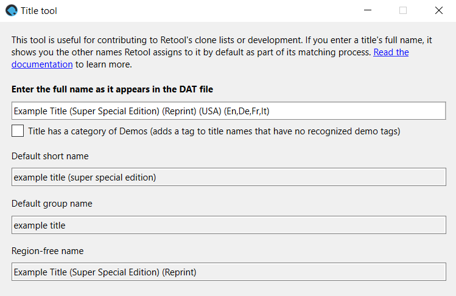

---
hide:
  - footer
---

# Retool's naming system

Retool generates multiple names for each [title](terminology.md#titles) in a DAT to help
match and group together titles more accurately. These names are used directly in the
code, and also [clone lists](clone-lists.md). If you plan to contribute to Retool, it
helps to understand this standard.

## Title tool

Retool's different naming conventions can take a while to get used to. To help you
start, you can use the title tool in Retool GUI. Open Retool GUI, then click
**File > Title tool** to launch it. Paste in the full name you've found in the DAT
you're working on, and it shows you the other names Retool assigns to that title by
default.



## Full names

Full names are the names of titles as presented in the DAT file, including tags. For
example:

```
This is a title (USA) (En,Fr) (Disc A) (Best Collection)
```

## Group names

Group names are how Retool bundles together similar titles to compare against each other.

Group names take only the content before the first `(` in full names, and are in
lowercase. Additionally, any string that looks like a version is stripped.

For example, the following full names:

```
This is a title v1.00 (USA) (En,Fr) (Disc A) (Best Collection)
This is a title v1.00 (USA) (En,Fr) (Disc B) (Best Collection)
```

Are both assigned to the same group by default:

```
this is a title
```

Group names are derived from three places:

* The full name of a title (default).
* `group` values in the [`variants`](contribute-clone-lists-variants.md) array in
  a clone list.
* `newGroup` or `elseGroup` values in the [`overrides`](contribute-clone-lists-overrides.md)
  array in a clone list.

## Region-free names

Region-free names are the same as full names, except their regions and languages have been
stripped.

For example, the following full name:

```
This is a title (USA) (En,Fr) (Disc A) (Best Collection)
```

Has the following region-free name:

```
This is a title (Disc A) (Best Collection)
```

## Tag-free names

Tag-free names are the same as full names, except they have [normalized disc names](#normalized-disc-names),
and [tags](terminology.md#tags) have been stripped from them as defined in the
`ignore_tags`, `promote_editions`, `demote_editions`, and `modern_editions` arrays in
`config/internal-config.json`. Tag-free names still include regions and languages.

For example, the following full name:

```
This is a title (USA) (En,Fr) (Disc A) (Best Collection)
```

Has the following tag-free name:

```
This is a title (USA) (En,Fr) (Disc 1)
```

### Normalized disc names

For tag-free names (and as a consequence, short names), Retool attempts to align all
naming variants for discs to the one standard for better automated matching of titles.
That is, variants like _(Disc 1)_, _(Disc A)_, _(Disco Uno)_, and _(Side A)_ are all
_(Disc 1)_ as far as Retool is concerned. This is also true if you're using tag-free or
short names in clone lists.

The replace strings for normalized disc names are in the `disc_rename` object in
`config/internal-config.json`. This is not a 1:1 mapping of what the disc name is and what
it should be. Instead, it's a sequential set of string replacements that's iterated over
when processing a title's full name, so the order is important.

## Short names

Short names are a shortened version of full names, most often used in [clone lists](clone-lists.md)
as a handy way to reference many titles at once without having to list the full name of
every variant. The short name is built by first getting the tag-free name (which also
normalizes disc names), and then getting the region-free name from that. It is then
converted to lowercase to avoid casing issues.

The short name also acts as a differentiator for titles that get bundled into the same
group, but shouldn't be treated as 1:1 matches.

For example, the following full names:

```
This is a title (USA) (En,Fr) (Disc A) (Best Collection)
This is a title (USA) (En,Fr) (Disc B) (Best Collection)
```

Are both assigned to the same group by default:

```
this is a title
```

However, because they are different discs from the same set and not equivalent titles,
they get assigned different short names:

```
this is a title (disc 1)
this is a title (disc 2)
```

This prevents them from being considered as clones of each other.
